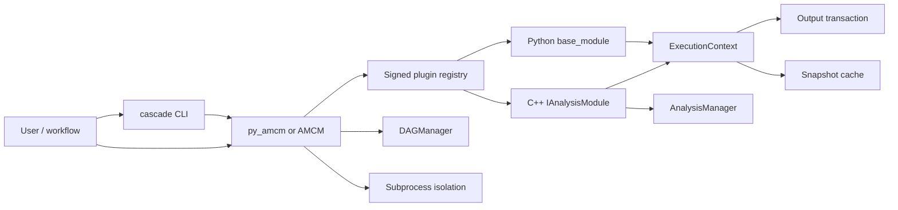

# Architecture

Cascade separates analysis logic from execution and distribution concerns.



The full diagram source is [architecture.mmd](architecture.mmd).

## Boundary 1: core versus plugins

Core libraries provide lifecycle, managers, caching, plugin verification, and
control APIs. Physics/experiment-specific analysis modules live in signed packages.
This keeps the runtime reusable and makes module provenance explicit.

## Boundary 2: module logic versus execution

Modules implement three user phases:

```text
Init -> Execute -> Finalize
```

The framework inserts:

- context creation;
- dry-run/cache check;
- cancellation checks;
- exception conversion;
- output/cache commit;
- rollback and terminal status.

The same contract is implemented by C++ `IAnalysisModule` and Python
`base_module`.

## Boundary 3: durable versus in-memory state

Transactional files and snapshot cache records are durable. Manager instances and
module fields are process memory. This distinction matters in isolated execution:
durable results survive, child memory does not return to the parent.

## Boundary 4: analysis config versus module parameters

`AnalysisManager` config describes ROOT structure and expressions. Module
parameters describe one module instance's externally configurable choices. Both
contribute to reproducibility, but they have different schemas and validation
paths.

## Main data flows

### Registration

```text
signed manifest
  -> signature/hash verification
  -> ABI verification (C++)
  -> module factory/class index
  -> controller instance
```

### Execution

```text
registered parameters + manager config + code hash
  -> snapshot
  -> cache decision
  -> analysis phases
  -> staged output
  -> promotion journal
  -> cache commit
  -> RunResult
```

### DAG

```text
validated nodes/dependencies
  -> dependencies first
  -> optional generic data links
  -> node callback and recorded node state
  -> failed descendants blocked
  -> durable output consumed downstream
```

## Ownership

- Controller owns registered module handles.
- Each C++ module owns its `AnalysisManager` instances.
- Manager-created ROOT objects are owned by the manager.
- User-supplied trees/histograms are borrowed unless ownership is explicitly
  transferred.
- RDF forks share the input-chain lifetime needed by their nodes.
- `ExecutionContext` owns active staging and rollback state.

## Concurrency

Registries and controller bookkeeping are guarded. One module instance serializes
its runs; independent instances can run concurrently. External output paths and
non-thread-safe ROOT/application resources remain the module author's
responsibility.
