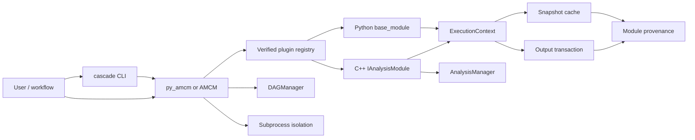

# Architecture

Cascade separates analysis logic from execution and distribution concerns.



The full diagram source is [architecture.mmd](architecture.mmd).

## Boundary 1: core versus plugins

Core libraries provide lifecycle, managers, caching, plugin verification, and
control APIs. Physics/experiment-specific analysis modules live in verified
packages, with optional publisher signatures for distribution.
This keeps the runtime reusable and makes module provenance explicit.

## Boundary 2: module logic versus execution

Modules implement three user phases:

```text
Init -> Execute -> Finalize
```

The framework inserts:

- context creation;
- dry-run/cache check;
- cancellation checks;
- exception conversion;
- output/cache commit;
- rollback and terminal status.

The lifecycle state machine, snapshot/cache decision, transaction, provenance,
plugin verification, and DAG execution are implemented once in C++. C++
`IAnalysisModule` and Python `base_module` provide language-specific user hooks on
that shared contract. Python retains object adaptation and import logic rather than
a second execution implementation.

## Boundary 3: durable versus in-memory state

Transactional files, provenance manifests, and snapshot cache records are
durable. Manager instances and module fields are process memory. This distinction
matters in isolated execution: durable results survive, child memory does not
return to the parent.

## Boundary 4: analysis config versus module parameters

`AnalysisManager` config describes ROOT structure and expressions. Module
parameters describe one module instance's externally configurable choices. Both
contribute to reproducibility, but they have different schemas and validation
paths.

## Main data flows

### Registration

```text
persistent prefix config + runtime prefix
  -> package roots
  -> package manifest
  -> boundary/hash verification
  -> optional trusted signature
  -> ABI verification (C++)
  -> module factory/class index
  -> controller instance
```

### Execution

```text
registered parameters + manager config + tracked-input identity + code hash
  -> snapshot
  -> cache decision
  -> analysis phases
  -> staged output
  -> module provenance + artifact hashes
  -> promotion journal
  -> cache-to-provenance linkage
  -> RunResult
```

### DAG

```text
validated nodes/dependencies
  -> dependencies first
  -> optional generic data links
  -> node callback and recorded node state
  -> failed descendants blocked
  -> durable output consumed downstream
  -> workflow provenance referencing module manifests
```

## Ownership

- Controller owns registered module handles.
- Each C++ module owns its `AnalysisManager` instances.
- Manager-created ROOT objects are owned by the manager.
- User-supplied trees/histograms are borrowed unless ownership is explicitly
  transferred.
- RDF forks share the input-chain lifetime needed by their nodes.
- `ExecutionContext` owns active staging and rollback state.

## Concurrency

Registries and controller bookkeeping are guarded. One module instance serializes
its runs; independent instances can run concurrently. Parameters are immutable for
the duration of a run. Hierarchical inter-process locks protect overlapping staged
output commits, and recovery uses recorded artifact identity to avoid reverting a
newer publisher.

ROOT work remains process-wide serialized. C++ modules that declare no analysis
manager use, plus isolated processes, may use the bounded DAG pool. Python
in-process modules use the conservative serial lane because the framework cannot
prove that plugin globals and imported libraries are thread-safe. External side
effects and unregistered direct output paths remain the module author's
responsibility.
