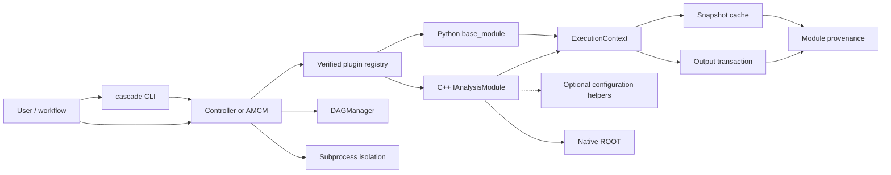

# Architecture

Cascade separates analysis logic from execution and distribution concerns.


```mermaid
flowchart LR
    U["User / workflow"] --> Q["cascade CLI"]
    U --> C["Controller or AMCM"]
    Q --> C
    C --> R["Verified plugin registry"]
    R --> M["C++ IAnalysisModule"]
    R --> P["Python base_module"]
    M --> X["ExecutionContext"]
    P --> X
    X --> O["Output transaction"]
    X --> K["Snapshot cache"]
    O --> V["Module provenance"]
    K --> V
    M -.-> A["Optional configuration helpers"]
    M --> N["Native ROOT"]
    C --> D["DAGManager"]
    C --> I["Subprocess isolation"]
```

The full diagram source is [architecture.mmd](architecture.mmd).

## Boundary 1: core versus plugins

Core libraries provide lifecycle, managers, caching, plugin verification, and
control APIs. Physics/experiment-specific analysis modules live in verified
packages, with optional publisher signatures for distribution.
This keeps the runtime reusable and makes module provenance explicit.

The public `IAnalysisModule.hh` is declaration-only and does not include ROOT.
Lifecycle, cache, and provenance live in the core
library behind an implementation object. This keeps the plugin class layout small
and prevents internal runtime fields from becoming a permanent ABI contract.
Plugins that actually use ROOT may include ROOT headers in their own source;
ROOT-free modules do not need them.

## Boundary 2: module logic versus execution

Modules implement three user phases:

```text
Init -> Execute -> Finalize
```

The framework inserts:

- context creation;
- dry-run/cache check;
- cancellation checks;
- exception conversion;
- output/cache commit;
- rollback and terminal status.

The lifecycle state machine, snapshot/cache decision, transaction, provenance,
plugin verification, and DAG execution are implemented once in C++. C++
`IAnalysisModule` and Python `base_module` provide language-specific user hooks on
that shared contract. Python retains object adaptation and import logic rather than
a second execution implementation.

## Boundary 3: durable versus in-memory state

Transactional files, provenance manifests, and snapshot cache records are
durable. Native ROOT objects and module fields are process memory. This distinction
matters in isolated execution: durable results survive, child memory does not
return to the parent.

## Boundary 4: analysis config versus module parameters

`AnalysisConfig` describes cut and histogram expressions without owning ROOT state. Module
parameters describe one module instance's externally configurable choices. Both
contribute to reproducibility, but they have different schemas and validation
paths.

## Main data flows

### Registration

```text
persistent prefix config + runtime prefix
  -> package roots
  -> package manifest
  -> boundary/hash verification
  -> optional trusted signature
  -> ABI verification (C++)
  -> module factory/class index
  -> controller instance
```

### Execution

```text
registered parameters + custom snapshot + tracked-input identity + code hash
  -> snapshot
  -> cache decision
  -> analysis phases
  -> staged output
  -> module provenance + artifact hashes
  -> promotion journal
  -> cache-to-provenance linkage
  -> RunResult
```

### DAG

```text
validated nodes/dependencies
  -> dependencies first
  -> optional generic data links
  -> node callback and recorded node state
  -> failed descendants blocked
  -> durable output consumed downstream
  -> workflow provenance referencing module manifests
```

## Ownership

- Controller owns registered module handles.
- Analysis code owns its native ROOT objects and graph lifetimes.
- Configuration helpers return values and retain no execution state.
- `ExecutionContext` owns active staging and rollback state.

## Concurrency

Registries and controller bookkeeping are guarded. One module instance serializes
its runs; independent instances can run concurrently. Parameters are immutable for
the duration of a run. Hierarchical inter-process locks protect overlapping staged
output commits, and recovery uses recorded artifact identity to avoid reverting a
newer publisher.

ROOT work remains process-wide serialized. C++ modules that declare `UsesRoot() == false`, plus isolated processes, may use the bounded DAG pool. Python
in-process modules use the conservative serial lane because the framework cannot
prove that plugin globals and imported libraries are thread-safe. External side
effects and unregistered direct output paths remain the module author's
responsibility.
